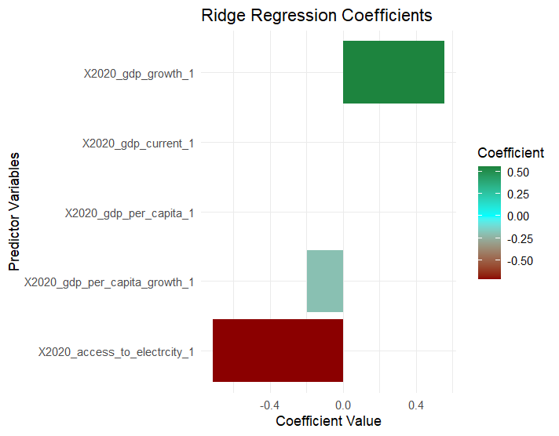

# Regression Analysis On Renewable Energy - World Bank Data
All code for data cleaning and combining of various datasets can be found in the R file "Data Cleaning for Renewable Energy Analysis.R" in this repository. The analysis post this can be found in "Renewable Energy Analysis.R".
## Project Overview
This project utilizes regression models to analyze the impact of various predictors on the percentage of renewable energy consumption across countries worldwide in the year 2020 (this was the latest year with maximum completeness of data across all the variables at the time of creating these models). 

The goal is to understand how different factors influence a country's reliance on renewable energy sources.

## Data Source
The final dataset was made by downloading multiple files (one for each predictor variable and one for the dependent variable) from the World Bank website: https://data.worldbank.org/indicator. 

Extensive data cleaning was then performed to format and prepare the data for analysis. This included manually removing 'aggregation' in the World Bank data (in addition to country names, the files included aggregate statistics such as for "East Asia & Pacific" etc) as I wanted to focus exclusively on all the countries of the world. Formatting transformations were employed to make the dataset usable for regression analysis.

## Predictor Variables
The study focuses on the following predictors:

Access to Electricity (% of population)
Investment in Energy with Private Participation (current US$)
Gini Index (a measure of income inequality)
GDP (current US$)
GDP Growth (annual %)
GDP per Capita (current US$)
GDP per Capita Growth (annual %)

## Analysis Approach
### Simple Multivariate Regression

Objective: 
Quickly assess the impact of predictors on renewable energy usage.

Key Findings:
A statistically significant model with an Adjusted R-square value of 52.9%, indicating the model explains this percentage of variability in renewable energy usage.

Most significant variables: Access to electricity (negative significance), GDP per capita growth (negative significance), GDP growth (positive correlation).
GDP and GDP per capita showed no statistical significance, suggesting a complex relationship with renewable energy usage.

#### Issues Identified
Some results on the predictor coefficients are unexpected. I expected access to electricity and GDP per capita to have a positive significance (the fact that GDP per capita and overall GDP point in opposite directions itself is strange).
A possible issue could be that of "multi-collinearity" - where the predictor variables themselves are highly co-related and could impact this analysis. This seems possible based on the variables I have selected.

Multi-Collinearity: High correlation among predictor variables, particularly between GDP growth and GDP per capita growth, detected using Variance Inflation Factors (VIF).

A more sophisticated model could thus be required. 

### Ridge Regression Model:

Context and Objective:
A Ridge Regression is a model that, among other things, seeks to solve the problem of multicollinearity. It does this via 'regularization' which is the introduction of the 'penalty' term on the sum of the squared coefficients (this is represented by lambda) which shrinks the coefficients. 

Results:
Optimal lambda for minimizing cross-validation error: 2.007.
Metrics: MSE = 365.604, RMSE = 19.12078, MAE = 15.25953, R-squared = 0.5304.
Comparison: Ridge regression shows slightly better predictive accuracy than the multivariate model, with lower RMSE and MSE, suggesting effectiveness in addressing multicollinearity.

## Conclusion
The ridge regression model, with its control for multicollinearity and overfitting, offers a slightly more accurate prediction of renewable energy usage than the simple multivariate regression, despite the complexities identified with some predictor variables.

The fact of 'unexpected' behavior in predictor variables - (i) access to electricity and GDP per capita has a negative significance & (ii) GDP per capita and overall GDP point in opposite directions - still remain despite addressing multicollinearity. 

This could be because of the nature of such variables - there are many more 'hidden' interactions that these can have with other factors for which data is unavailable. This can sometimes be a problem with data analysis in more 'social science' settings; often the quantitative analysis would have to be supplemented by a qualitative analysis to get the full picture. 

Thus, these unexpected interactions are simply a consequence of the dataset and could require more creative thinking into what other common interactions these and the dependant variable would have with other 'hidden' factors, and how they could be incorporated into the dataset.
